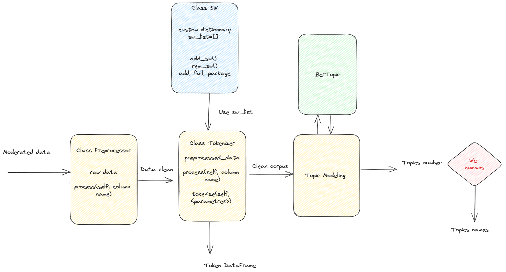

# COLLABORATION HETIC - DITP

## Création d'un ensemble d'algorithmes pour faire un reporting des google reviews 

### Dépendances

- python3: [https://www.python.org/downloads/](https://www.python.org/downloads/)
- pipenv: [https://pypi.org/project/pipenv/](https://pypi.org/project/pipenv/)
  
### Le but

Cibler la collecte des avis 
Sur le périmètre du programme Services Publics + 

Conformité au cadre légal et administratif
Réglementation européenne, en particulier le RGPD (et son interprétation par la CNIL)
Code des relations entre le public et l’administration
Cadre réglementaire propre à SP+ [https://www.legifrance.gouv.fr/jorf/id/JORFTEXT000043965490](https://www.legifrance.gouv.fr/jorf/id/JORFTEXT000043965490)

Pas d’outils payants

Aucune action autre que l’extraction et l’analyse des données 
Pas de création de compte
Pas de formulaire
Pas de démarche active auprès des usagers

Vous verrez ci-dessous un schéma d'architecture qui illustre nos idées.

<p align="center">
    
</p>

Afin de réaliser toutes ces étapes nous avons conçus différents algorithmes.
Le premier étant un algorithme qui a pour but de scrapper les avis des google reviews à partir d'adresses que l'on a récupéré sur un [le référentiel de structure](https://www.data.gouv.fr/fr/datasets/referentiel-structure-de-la-plateforme-services-publics-plus-de-la-ditp/).

Par la suite, nous exécutons un autre script, [scrapping_adresse_gouv.py](https://github.com/LonneQuent/PE-x-DTIP/blob/main/scrapping/scrapping_adresse_gouv.py), qui a pour vocation de reqûeter  [l'api gratuite du gouvernement](https://api.gouv.fr/documentation/api_etablissements_publics) afin de récupérer des avis sur d'autres services que celui de la Gendarmerie Nationale.

<p align="center">
    
</p>

Notre algorithme de scraping génère un fichier.csv suivant le format suivant:

```bash
| Index | Adresse | Auteur | Date | Note | Commentaire |
```

Nous allons exploiter ce fichier pour deux objectifs:

   -la première est pour la partir NLP. Le but est d'extraire des topics à partir des commentaires afin d'établir un diagnostic des dysfonctionnements des services publics.
   Son procédé suit le schéma suivant : 

<p align="center">
   
</p>

Un modèle KNN est disponible pour prédire les canaux de communication des usagers parmi les trois majoritaires mais il n'a pas été utlisé pour le topic modeling (à affiner) 

  -la deuxième pour dresser une répartition des notes des services publics sur tout le territoire (principalement la métropole) avec prise en compte des messages vides ou non.

Afin de réaliser un streamlit à partir de nos résultats de scrapping nous devons fournir une donnée lisible. L'idée de ce pré traitement est à partir d'un [data set](https://simplemaps.com/data/fr-cities) qui contient les latitude et longitude des villes de faire une carte qui regroupe les avis par ville.

Pour consulter le streamlit, c'est par ici !
[lien vers le streamlit](https://lonnequent-pe-x-dtip-streamlit-eagk6f.streamlit.app/)
