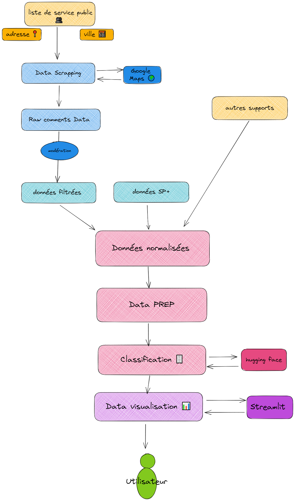
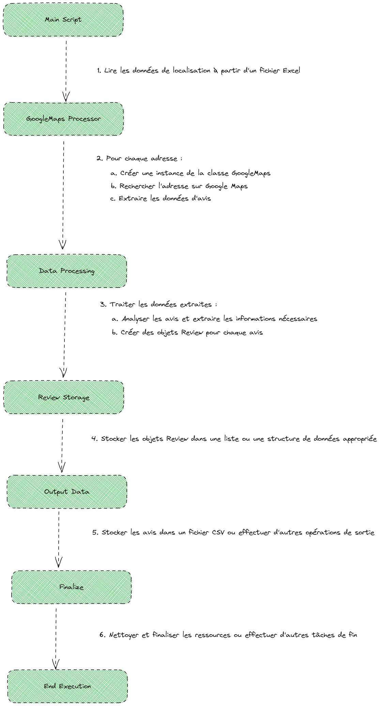

# COLLABORATION HETIC - DITP

## Création d'un ensemble d'algo pour faire un reporting des google reviews 

### Requirements

- python3: [https://www.python.org/downloads/](https://www.python.org/downloads/)
- pipenv: [https://pypi.org/project/pipenv/](https://pypi.org/project/pipenv/)
  
### Le but

Cibler la collecte des avis 
Sur le périmètre du programme Services Publics + 

Conformité au cadre légal et administratif
Réglementation européenne, en particulier le RGPD (et son interprétation par la CNIL)
Code des relations entre le public et l’administration
Cadre réglementaire propre à SP+ [https://www.legifrance.gouv.fr/jorf/id/JORFTEXT000043965490](https://www.legifrance.gouv.fr/jorf/id/JORFTEXT000043965490)


Pas d’outils payants

Aucune action autre que l’extraction et l’analyse des données 
Pas de création de compte
Pas de formulaire
Pas de démarche active auprès des usagers

Vous verrez ci dessous un schéma d'architecture qui illustre nos idées.

<p align="center">
    
</p>

Afin de réaliser toutes ces étapes on a crée différents algo.
Le premier étant un algo qui a pour but de scrapper les avis des google reviews à partir d'adresses que l'on a récupéré sur un [le référentiel de structure](https://www.data.gouv.fr/fr/datasets/referentiel-structure-de-la-plateforme-services-publics-plus-de-la-ditp/).

À noter que l'on a ensuite fait un autre algo de scrapping, [scrapping_adresse_gouv.py](https://github.com/LonneQuent/PE-x-DTIP/blob/main/scrapping/scrapping_adresse_gouv.py), cet algo là avait pour but d'utiliser [l'api gratuite du gouvernement](https://api.gouv.fr/documentation/api_etablissements_publics) afin de récupérer des avis sur d'autres services que celui qu'on a utilisé de base (les gendarmeries nationales).

<p align="center">
    
</p>

Une fois l'algorythme de scrapping finis il nous sort un csv avec comme entête ce format:

```bash
| Index | Adresse | Auteur | Date | Note | Commentaire |
```

Ce fichier on va s'en servir pour deux choses:

    -la première est pour la partir NLP. Le but est, à partir de ces commentaires, de pouvoir 
    en tirer des topics afin de pouvoir prendre des mesures en fonction du commentaires poster.

    -la seconde est de pouvoir utiliser les notes et leurs localisations afin de pouvoir
    voir la répartition des notes.

Afin de réaliser un streamlit à partir de nos résultat de scrapping on aura déjà un pré traitement de la donnée. L'idée de ce pré traitement est à partir d'un [data set](https://simplemaps.com/data/fr-cities) qui contient les latitude et longitude des villes de faire une carte qui regroupe les avis par ville.

Et à la fin on a un streamlit à partir duquel on peut tirer divers informations.

[lien vers le streamlit](https://lonnequent-pe-x-dtip-streamlit-eagk6f.streamlit.app/)